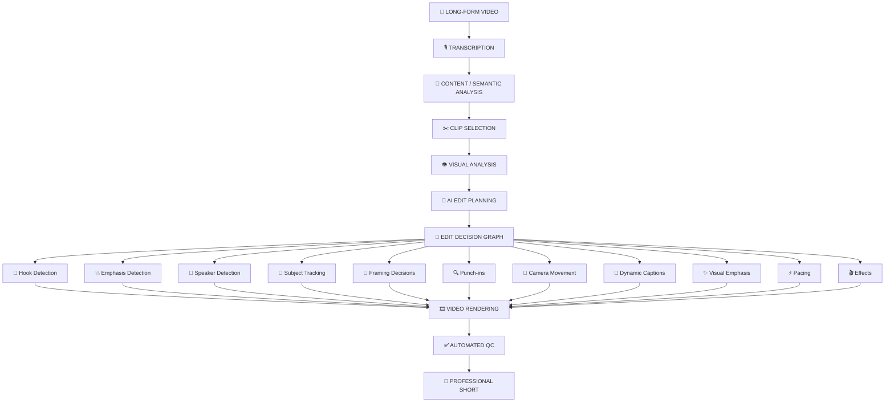
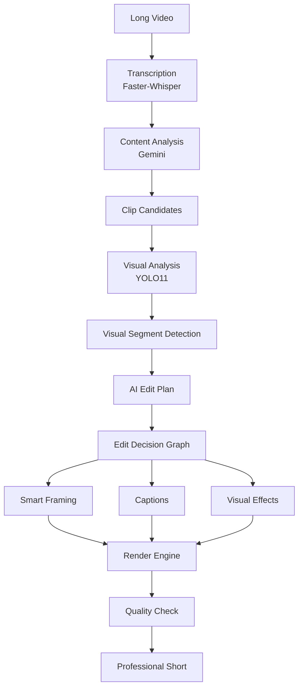
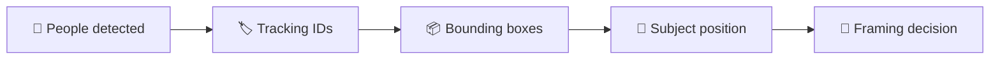
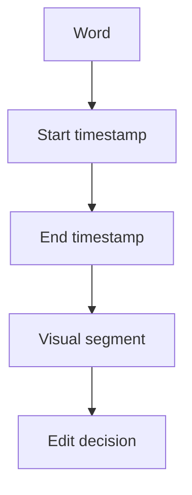
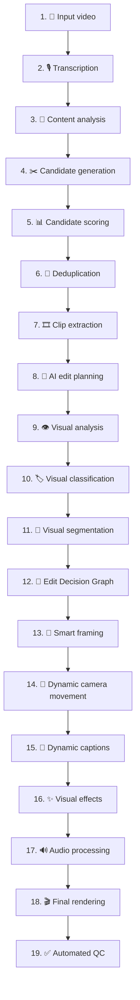
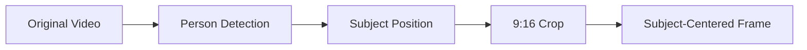
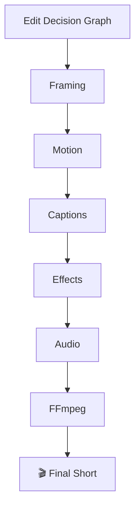
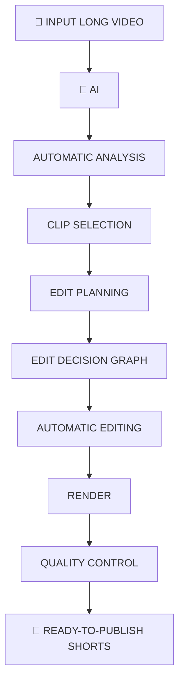
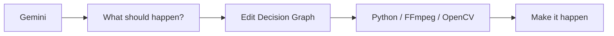

<div align="center">

# 🎬 AI Clipping & Professional Shorts Editing Pipeline 
  Designed and made By Deep-2308, 
  Under Production(Working in Progress)

### From long-form video → AI-understood → intelligently edited → professional short-form content

<p>
  
  
  
  
</p>

<p>
  
  
  
  
  
</p>

<p>
  <b>Local-first</b> • <b>AI-native</b> • <b>Semantic editing</b> • <b>Computer vision</b> • <b>Deterministic rendering</b>
</p>

</div>

---

## ✨ What is this?

An AI-powered, local-first video clipping and editing pipeline designed to transform long-form videos such as **podcasts, interviews, documentaries, and educational content** into professional short-form videos for:

- 📱 YouTube Shorts
- 📸 Instagram Reels
- 🎵 TikTok

The system combines **AI content understanding, speech transcription, semantic analysis, computer vision, subject tracking, edit decision generation, dynamic framing, captions, effects, and automated quality control**.

> **Current status:** V1 → V13.3 completed  
> **Current development stage:** V14, Subject-Aware Framing 🚀

---

## 🧭 Project Vision

Most automatic clipping tools stop at:

```text
Long Video
    ↓
Find Interesting Moment
    ↓
Crop to 9:16
    ↓
Add Captions
    ↓
Export
```

This project aims to go much further.

The goal is to build an **AI editing system that understands why a moment is interesting and decides how it should be edited**.

### The intended pipeline



---

# 🎯 Core Goals

The project is designed around several goals:

- 🎯 Automatically identify high-value moments from long videos
- 🧠 Use AI to understand the content instead of relying only on timestamps
- 🎙️ Generate accurate word-level transcription
- 👁️ Analyze people and visual composition
- 🎥 Track subjects using computer vision
- 📱 Produce proper vertical 9:16 content
- 🔍 Automatically decide when to zoom or change framing
- 💬 Generate dynamic captions
- ⚡ Emphasize important words and phrases
- 🎬 Add purposeful visual movement and effects
- 🔊 Improve audio and pacing
- ✅ Automatically validate the final output
- 💻 Run the core pipeline locally without requiring expensive editing subscriptions

---

# 🧠 Architecture

The system is being developed as a versioned pipeline.



---

# 📌 Current Development Status

| Version | Component | Status |
|:---:|---|:---:|
| V1 | Initial clipping pipeline | ✅ |
| V2 | Clip analysis | ✅ |
| V3 | Improved content analysis | ✅ |
| V4 | AI clip candidate generation | ✅ |
| V5 | Clip deduplication | ✅ |
| V6 | Production manifest | ✅ |
| V7 | Raw clip extraction | ✅ |
| V8 | Vertical rendering | ✅ |
| V9 | Vertical rendering fixes | ✅ |
| V10 | Automated quality control | ✅ |
| V11 | AI edit planning | ✅ |
| V12 | Visual intelligence | ✅ |
| V13 | Edit Decision Graph | ✅ |
| V13.1 | Source-to-clip timestamp correction | ✅ |
| V13.2 | Word-level edit alignment | ✅ |
| **V13.3** | **Atomic word timeline + global emphasis matching** | **✅** |
| V14 | Subject-aware framing | 🔜 |
| V15 | Camera movement & punch-ins | 🔜 |
| V16 | Professional dynamic captions | 🔜 |
| V17 | Visual emphasis & effects | 🔜 |
| V18 | B-roll intelligence | 🔜 |
| V19 | Audio & pacing | 🔜 |
| V20 | Professional render engine | 🔜 |
| V21 | Automated visual/audio QC | 🔜 |
| V22 | End-to-end orchestration | 🔜 |

---

<details>
<summary><h2>🎬 V1–V10: Foundation Pipeline</h2></summary>

The first stage established the basic automated clipping workflow.

The system can:

1. Analyze a long-form video
2. Generate potential clip windows
3. Score candidate clips
4. Remove duplicate/overlapping candidates
5. Create a production manifest
6. Extract raw clips
7. Convert clips to vertical format
8. Generate captions
9. Perform automated quality checks

The original pipeline successfully generated:

- 10 unique clips
- Raw clips
- Vertical clips
- Final rendered clips
- Automated QC results

### V10 Quality Control

```text
Total clips: 10
Passed:      10
Failed:       0
```

</details>

---

<details>
<summary><h2>🤖 V11: AI Edit Planning</h2></summary>

V11 introduced an AI editing layer using Gemini.

Instead of simply asking:

> "Where should the clip start and end?"

the system asks the AI to determine **how the clip should be edited**.

The AI edit plan contains decisions such as:

- Segment type
- Importance
- Framing
- Zoom level
- Camera movement
- Pacing
- Caption emphasis
- Important words
- Hook
- Payoff

### Example conceptual edit

```text
HOOK
0s → 3s
Zoom: 1.00 → 1.10
Movement: Push-in
Importance: Critical

NORMAL
3s → 8s
Framing: Wide
Movement: Static

EMPHASIS
8s → 18s
Zoom: 1.00 → 1.05
Movement: Push-in

PAYOFF
27s → 34s
Zoom: 1.12 → 1.15
Importance: Critical
```

This creates a foundation for **semantic editing rather than static video processing**.

</details>

---

<details>
<summary><h2>👁️ V12: Visual Intelligence</h2></summary>

V12 introduced computer vision.

The pipeline uses **YOLO11** to detect and track people inside clips.

### Visual analysis provides

- Number of people
- Person positions
- Bounding boxes
- Confidence
- Tracking IDs
- Subject size
- Subject location
- Frame composition



The system also analyzes visual segments and classifies footage into categories such as:

```text
speaker
b_roll
map
graphic
multiple_people
unknown
```

It can then recommend treatments such as:

```text
speaker_crop
preserve_composition
slow_push_in
```

</details>

---

<details>
<summary><h2>🧠 V13: Edit Decision Graph</h2></summary>

V13 is where the project moved from independent AI outputs toward a unified editing representation.

The **Edit Decision Graph (EDG)** combines:

- Transcript
- Word timestamps
- Visual segments
- AI edit plan
- Emphasis words
- Visual treatment
- Timing
- Alignment information

The goal is to create a machine-readable description of **exactly what should happen at every point in the video**.

</details>

---

# 🔥 V13.3: Atomic Word Timeline

V13.3 is the current completed version.

It solved several important synchronization problems.

## Problem

AI emphasis phrases could cross visual segment boundaries.

For example:

```text
120 world leaders
```

could span:

```text
Visual Segment 1
        ↓
Visual Segment 2
```

Earlier implementations could duplicate or incorrectly assign words.

## V13.3 Solution

The system now treats every transcript word as an **atomic timeline unit**.



The system searches for emphasis phrases across the **entire clip-level word timeline** instead of restricting the search to individual visual segments.

---

# 📊 V13.3 Validation

The current V13.3 test produced:

```text
Visual segments:       9
Atomic words assigned:  92
Unassigned words:       0

Emphasis requested:      8
Emphasis matched:        8
Emphasis unmatched:      0

Duplicate word assigns:  0
Chronological words:     True
Word coverage valid:     True
```

> 🎯 **Architectural checkpoint:** the editing system now has a reliable temporal foundation.

---

# 🎯 Example Emphasis Events

The current test clip produced emphasis events such as:

| Time | Emphasis |
|---|---|
| `1.56 – 2.84` | **single biggest disaster** |
| `4.66 – 5.80` | **120 world leaders** |
| `12.44 – 14.18` | **urgently in unity** |
| `21.93 – 22.47` | **the irony** |
| `26.23 – 26.45` | **Russia** |
| `30.63 – 31.83` | **superpower again** |
| `35.09 – 36.31` | **twice as fast** |
| `39.17 – 39.85` | **65 percent** |

These events can later drive:

- 💬 Caption highlighting
- 🔍 Zooms
- 🎥 Punch-ins
- ✨ Visual effects
- 🎞️ Motion
- 🔊 Sound effects
- 🎬 B-roll
- 🧩 Other semantic editing actions

---

# 🛠️ Technology Stack

### Programming

- Python 3.13
- JavaScript/Node.js where required

### AI

- Google Gemini
- `google-genai`

### Speech Recognition

- Faster-Whisper
- CTranslate2

### Computer Vision

- YOLO11
- Ultralytics
- OpenCV

### Video Processing

- FFmpeg
- FFprobe

### Data Processing

- NumPy
- Pydantic
- JSON

### Subtitle / Caption Processing

- `pysubs2`

### Hardware Acceleration

- NVIDIA CUDA
- PyTorch CUDA
- CUDA-enabled CTranslate2

---

# 💻 Hardware

The current development machine uses:

```text
GPU:
NVIDIA GeForce GTX 1050
VRAM: ~3 GB

CUDA:
12.6 PyTorch build

Compute Capability:
6.1
```

The project is designed to work within relatively limited GPU resources rather than assuming access to a high-end workstation.

---

# 📁 Project Structure

Current source structure:

```text
AI-Clipping/
│
├── .gitignore
│
├── ai_edit_engine_v11.py
│
├── analyze_clips.py
├── analyze_clips_v2.py
├── analyze_clips_v3.py
├── analyze_clips_v4.py
│
├── burn_captions.py
├── caption_clips_v9.py
│
├── create_manifest_v6.py
├── deduplicate_clips_v5.py
│
├── edit_decision_v13.py
├── edit_decision_v13_1.py
├── edit_decision_v13_2.py
├── edit_decision_v13_3.py
│
├── extract_clips.py
├── extract_clips_v7.py
│
├── generate_captions.py
├── quality_check_v10.py
│
├── render_vertical.py
├── render_vertical_v8.py
│
├── scene_detection_v12.py
│
├── test_gemini.py
├── test_whisper.py
├── transcribe.py
│
├── visual_analysis_v12.py
├── visual_classification_v12.py
└── visual_segments_v12.py
```

Generated files and media are intentionally excluded from Git through `.gitignore`.

---

# ⚙️ Installation

## 1. Clone the repository

```bash
git clone <YOUR_REPOSITORY_URL>
cd AI-Clipping
```

## 2. Create a virtual environment

```bash
python -m venv .venv
```

### Activate on Windows

```powershell
.venv\Scripts\activate
```

## 3. Install required packages

The exact dependency lockfile has not yet been finalized.

The current environment uses packages including:

```text
faster-whisper
google-genai
ultralytics
torch
opencv-python
numpy
pillow
pydantic
pysubs2
```

FFmpeg and FFprobe must also be available on the system `PATH`.

---

# 🔑 Environment Variables

The project uses environment variables for API credentials.

Example:

```env
GEMINI_API_KEY=your_api_key_here
```

> 🔐 **Never commit API keys to GitHub.**

The repository `.gitignore` already excludes:

```text
.env
.env.*
```

Do not place real credentials directly inside Python source files.

---

# 🎥 Input Video

Place source videos inside:

```text
input/
```

For example:

```text
input/
└── real_test.mp4
```

The `input/` directory is intentionally excluded from Git because source videos can be extremely large.

---

# 📤 Generated Output

Generated processing results are stored under:

```text
output/
```

Typical outputs include:

```text
transcript.json
clip_candidates.json
production_manifest.json
ai_edit_plan_v11.json
visual_analysis_v12.json
visual_classification_v12.json
visual_segments_v12.json
edit_decision_v13_3.json
```

Rendered media is also generated under the output directory.

These files are excluded from the Git repository.

---

# 🔄 Pipeline Workflow

A typical processing flow is:



---

# 🧪 Testing Philosophy

The project is being developed incrementally.

Each major version should:

1. Build one capability
2. Test it on a real video
3. Validate the output
4. Identify failure cases
5. Fix the architecture
6. Freeze the working version
7. Move to the next layer

This prevents the project from becoming a large collection of unverified AI-generated editing logic.

---

# ⚠️ Current Limitations

The current V13.3 system is **not yet a complete professional editor**.

The major remaining gaps are:

### 🎯 Framing

Current visual intelligence identifies subjects, but the full production system still needs robust subject-aware 9:16 framing.

### 🎥 Camera movement

AI edit plans contain zoom/movement decisions, but the production render engine still needs to execute these decisions professionally.

### 💬 Captions

The current caption system needs to evolve into:

- Word-level timing
- Dynamic highlighting
- Emphasis styling
- Better positioning
- Animated text
- Professional typography

### ✨ Visual effects

Semantic effects are planned but not fully implemented.

### 🎬 B-roll

The system does not yet have a complete intelligent B-roll retrieval/insertion system.

### 🔊 Audio

Professional loudness normalization, ducking, cleanup, and pacing are still planned.

### 🎞️ Final rendering

The current pipeline has functional rendering, but the final production renderer needs to integrate all AI decisions into one coherent render process.

---

# 🗺️ Roadmap

## V14: Subject-Aware Framing

Use detected subjects to intelligently determine the crop.



---

## V15: Camera Movement & Punch-ins

Implement AI-directed:

- Push-ins
- Pull-outs
- Punch-ins
- Smooth camera movement
- Dynamic reframing
- Emphasis-based zooms

---

## V16: Professional Dynamic Captions

Build a modern short-form caption engine.

### Planned features

- Word-level highlighting
- Emphasis styling
- Animated captions
- Timing synchronization
- Position adaptation
- Safe-area awareness

---

## V17: Visual Emphasis & Effects

Use semantic events to trigger purposeful effects.

```text
Important statement
        ↓
     Punch-in
        ↓
Caption emphasis
        ↓
Subtle visual effect
```

> Effects should be used because they improve communication, not simply because they look flashy.

---

## V18: B-roll Intelligence

Build an intelligent visual insertion system capable of determining when supporting visuals are useful.

Potential sources include:

- Existing footage
- Maps
- Graphics
- Screenshots
- Relevant visual assets

---

## V19: Audio & Pacing

Improve:

- Loudness
- Speech clarity
- Silence handling
- Pacing
- Audio transitions
- Background audio handling

---

## V20: Professional Render Engine

Integrate the entire Edit Decision Graph into a unified renderer.



---

## V21: Automated Quality Control

Automatically inspect the final video for:

- Resolution
- Aspect ratio
- Audio presence
- Caption timing
- Visual glitches
- Black frames
- Rendering errors
- Duration
- Frame integrity

---

## V22: End-to-End Orchestrator

The final goal is a single workflow:



---

# 🧩 Design Principles

## 1. AI decides, deterministic code executes

AI should produce high-level editing decisions.

The renderer should execute those decisions deterministically.



## 2. Timing must be authoritative

Transcript timestamps, visual timestamps, and edit decisions must use a consistent timeline.

## 3. Every AI decision should be executable

An AI response is not useful if the renderer cannot reliably convert it into an actual edit.

## 4. Effects must have purpose

The system should avoid blindly adding:

- Random zooms
- Random transitions
- Excessive animations
- Unnecessary effects

Every effect should support:

**attention, clarity, pacing, or storytelling.**

## 5. Validate every stage

The pipeline should fail loudly when:

- timestamps are invalid
- words are duplicated
- segments overlap incorrectly
- media streams are missing
- output dimensions are incorrect
- rendering fails

---

# 🔐 Security

Never commit:

```text
.env
API keys
Passwords
Tokens
Private credentials
Large source videos
Generated media
```

The repository `.gitignore` already excludes common secrets, media, models, virtual environments, and generated output.

> 🚨 If an API key is accidentally exposed, **revoke/rotate it immediately**.

---

# 📜 Development Status

Current Git checkpoint:

```text
Branch:
main

Initial commit:
707e5c1

Commit:
Initial AI clipping pipeline through V13.3
```

The repository currently contains the source code for the completed pipeline through **V13.3**.

---

# 🎯 Final Objective

This project is ultimately intended to become more than an automatic clip generator.

The long-term goal is an **AI-native video editing engine** capable of understanding:

```text
What is being said?
        ↓
What matters?
        ↓
What should the viewer focus on?
        ↓
Where should the camera look?
        ↓
When should the frame move?
        ↓
Which words deserve emphasis?
        ↓
Should supporting visuals appear?
        ↓
How should the pacing change?
        ↓
How should the final short be rendered?
```

The final system should transform:

```text
15-minute / 30-minute / 1-hour video
```

into:

```text
Professional short-form content
```

with minimal manual editing.

---

# ⭐ Project Status

<div align="center">

### V13.3 COMPLETED ✅

</div>

| Capability | Status |
|---|:---:|
| 🎙️ Transcription | ✅ |
| ✂️ Clip Selection | ✅ |
| 🧠 AI Analysis | ✅ |
| 👁️ Visual Analysis | ✅ |
| 👤 Subject Detection | ✅ |
| 🧩 Visual Segmentation | ✅ |
| 🤖 AI Edit Planning | ✅ |
| ⏱️ Word Alignment | ✅ |
| 💥 Emphasis Matching | ✅ |
| 🧠 Edit Decision Graph | ✅ |
| 🎯 Smart Framing | 🔜 |
| 🎥 Camera Movement | 🔜 |
| 💬 Dynamic Captions | 🔜 |
| ✨ Visual Effects | 🔜 |
| 🎬 B-roll Intelligence | 🔜 |
| 🔊 Audio Processing | 🔜 |
| 🎞️ Professional Render | 🔜 |
| ✅ Automated QC | 🔜 |
| 🧩 End-to-End Orchestration | 🔜 |

<div align="center">

**Next milestone: V14 — Subject-Aware Framing 🚀**

</div>

---

## 📚 Project Philosophy

> **AI should understand the story.  
> The Edit Decision Graph should describe the edit.  
> Deterministic code should execute it.  
> Quality control should verify it.**

<div align="center">

### Built step-by-step. Tested on real video. Designed to scale from clipping to AI-native editing.

🚀 **V13.3 → V14**

</div>
